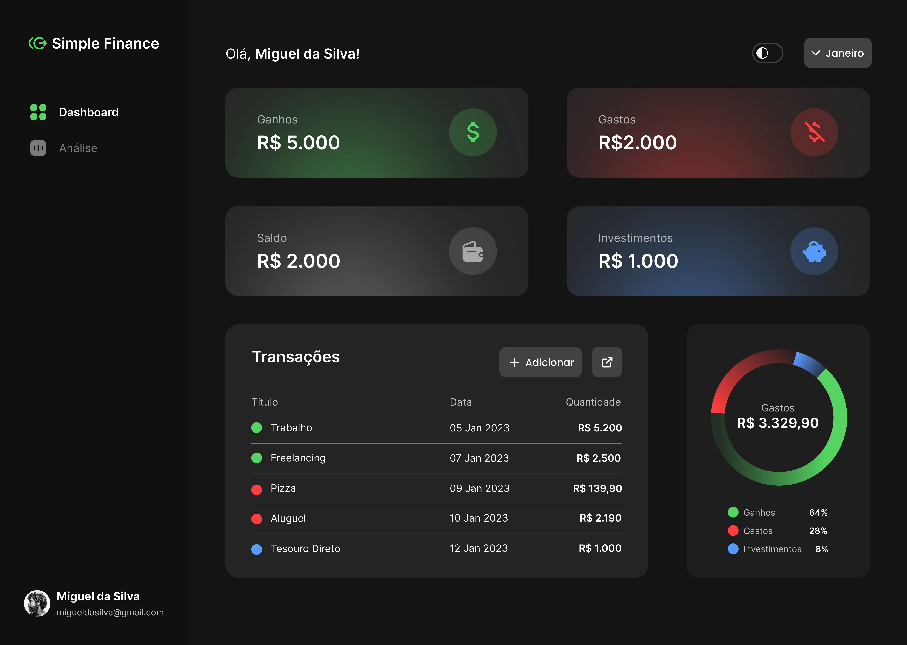
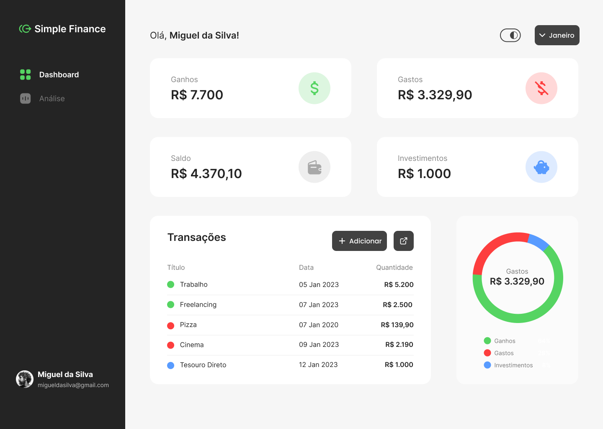
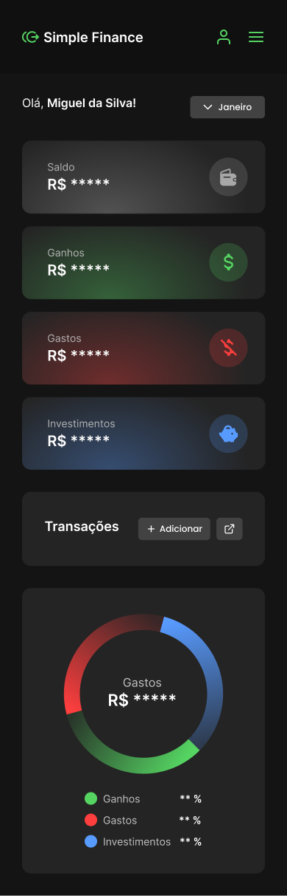
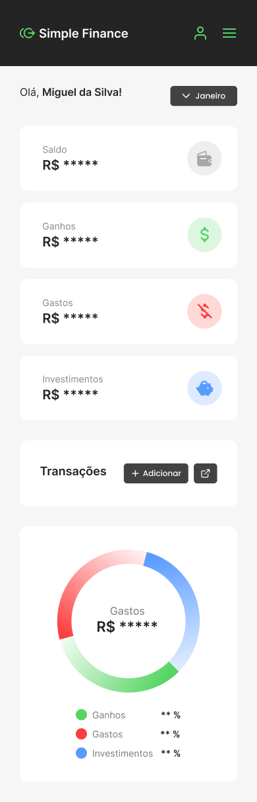

# 💰 Simple Finance

> Seu controle financeiro pessoal de forma simples, elegante e poderosa.

Uma aplicação web full-stack moderna para gerenciar suas finanças com precisão. Registre suas receitas, despesas, investimentos e acompanhe seu progresso financeiro em tempo real com visualizações intuitivas.


---

## 🎯 Características Principais

✨ **Dashboard Intuitivo** - Visualize seus dados financeiros em um único lugar com Cards informativos e gráficos em tempo real

💹 **Análise Financeira** - Gráficos de pizza interativos mostrando a distribuição de suas receitas, despesas e investimentos

📊 **Gestão de Transações** - Adicione, edite e acompanhe todas as suas transações financeiras de forma organizada

🎨 **Design Responsivo** - Interface moderna e adaptável para desktop, tablet e mobile

🔐 **Autenticação Segura** - Acesso seguro à sua conta com proteção de dados

📅 **Filtro por Período** - Analise suas finanças por mês com facilidade

---

## 🛠️ Stack Tecnológico

### Frontend

- **React** - Biblioteca JavaScript moderna para interfaces dinâmicas
- **HTML5** - Estrutura semântica e acessível
- **CSS3** - Estilos avançados com design responsivo

### Backend

- **Node.js** - Runtime JavaScript server-side de alto desempenho
- **Express.js** - Framework web minimalista e robusto
- **PostgreSQL** - Banco de dados relacional confiável

## 📦 Dependências Principais

### Backend

- **express** (v5.1.0) - Framework web robusto
- **pg** (v8.16.3) - Driver PostgreSQL para Node.js
- **bcrypt** (v6.0.0) - Criptografia segura de senhas
- **uuid** (v13.0.0) - Geração de IDs únicos
- **dotenv** (v17.2.3) - Gerenciamento de variáveis de ambiente
- **validator** (v13.15.15) - Validação de dados

### DevDependencies

- **ESLint** - Lintagem de código
- **Prettier** - Formatação de código
- **Husky** - Git hooks para qualidade de código
- **Lint-staged** - Executar linters em arquivos staged
- **Git Commit Msg Linter** - Validar mensagens de commit

---

- **Docker** - Containerização para deploy consistente
- **Git & GitHub** - Controle de versão e colaboração

### Arquitetura

O backend segue uma arquitetura limpa e escalável com camadas bem definidas:

- **Controllers** - Gerenciam as requisições HTTP
- **Repositories** - Acesso e manipulação de dados no banco
- **Use Cases** - Lógica de negócio centralizada
- **Helpers** - Funções utilitárias reutilizáveis

---

## 📸 Galeria

### Interface Desktop



### Interface Mobile



### Tema Escuro



### Light Mode



### Estrutura do Projeto


---

## 🚀 Como Começar

### Pré-requisitos

- Node.js (v22.0.0 ou superior)
- PostgreSQL (v12 ou superior)
- Docker (opcional)

### Instalação Local

#### 1. Clone o Repositório

```bash
git clone https://github.com/mamadusamadev/Controlo-Finaceiro.git
cd Controlo-Finaceiro
```

#### 2. Configure o Backend

```bash
cd finance-app-api

# Instale as dependências
npm install

# Configure as variáveis de ambiente
cp .env.example .env

# Execute as migrações do banco de dados
node src/db/postgres/migrations/exec.js

# Inicie o servidor em modo desenvolvimento
npm run start:dev
```

#### 3. Configure o Frontend

```bash
# Em outro terminal, navegue até o diretório do frontend
cd frontend

# Instale as dependências
npm install

# Configure as variáveis de ambiente
cp .env.example .env

# Inicie a aplicação
npm start
```

A aplicação estará disponível em `http://localhost:3000`

### Docker (Recomendado)

```bash
# Construa e execute os containers
docker-compose up -d

# Acesse em http://localhost:3000
```

---

## 📋 Scripts Disponíveis

```bash
# Desenvolver com hot-reload
npm run start:dev

# Executar migrações do banco de dados
node src/db/postgres/migrations/exec.js

# Verificar qualidade do código
npm run lint

# Formatar código automaticamente
npm run format
```

---

```
===== Backend ====

finance-app-api/
├── src/
│   ├── controllers/        # Controladores de requisições HTTP
│   ├── repositories/       # Acesso ao banco de dados
│   ├── use_case/          # Lógica de negócio
│   ├── helpers/           # Funções utilitárias
│   ├── db/                # Configuração do banco
│   └── index.js           # Entrada da aplicação
├── .env.example           # Variáveis de ambiente
├── package.json
└── docker-compose.yml     # Configuração Docker
```

---

## 🎮 Funcionalidades em Desenvolvimento

- ✅ Dashboard com resumo financeiro
- ✅ Gestão de transações (Criar, Ler, Atualizar, Deletar)
- ✅ Gráficos interativos
- ✅ Autenticação de usuários
- 🔄 Exportar relatórios em PDF
- 🔄 Integração com APIs de cotação de moedas
- 🔄 Notificações de metas atingidas

---

## 🤝 Contribuindo

Contribuições são bem-vindas! Se você tem sugestões de melhorias, abra uma [issue](https://github.com/mamadusamadev/Controlo-Finaceiro/issues) ou envie um pull request.

```bash
# Para contribuir:
1. Faça um Fork do projeto
2. Crie uma branch para sua feature (git checkout -b feature/AmazingFeature)
3. Commit suas mudanças (git commit -m 'Add some AmazingFeature')
4. Push para a branch (git push origin feature/AmazingFeature)
5. Abra um Pull Request
```

---

## 📝 Licença

Este projeto está licenciado sob a Licença MIT - veja o arquivo [LICENSE](LICENSE) para detalhes.

---

## 👨‍💻 Sobre o Autor

**Mamadu Sama** - Full Stack Developer & Estudante de ADS

Sou um desenvolvedor apaixonado por criar soluções inovadoras e escaláveis. Com experiência em desenvolvimento full-stack, estou sempre em busca de aprender novas tecnologias e desafios.

### Conecte-se comigo:

- 📧 Email: [mamadusama19@gmail.com](mailto:mamadusama19@gmail.com)
- 💼 LinkedIn: [linkedin.com/in/mamadusama](https://www.linkedin.com/in/mamadusama/)
- 🐙 GitHub: [@mamadusamadev](https://github.com/mamadusamadev)

---

## ⭐ Se este projeto foi útil para você, considere deixar uma star! Isso ajuda muito!

---

**Última atualização:** Outubro de 2025
